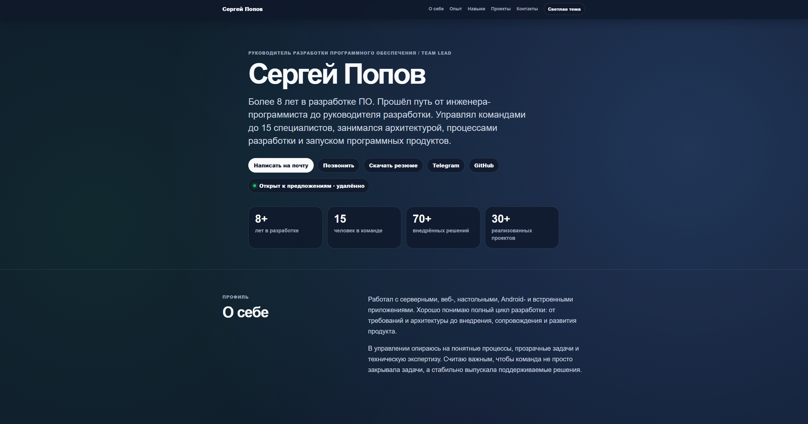

# Resume Website

Одностраничный сайт-резюме руководителя разработки программного обеспечения / Team Lead.

Сайт опубликован через GitHub Pages:  
https://semerest.github.io/resume-website/

## Preview



## О проекте

Проект сделан как персональный сайт-визитка и первый элемент GitHub-портфолио.

На сайте представлены:

- краткий профиль;
- ключевые результаты;
- опыт работы;
- подход к работе;
- навыки и технологии;
- портфолио проектов;
- контакты;
- ссылка на PDF-резюме.

## Что реализовано

- Адаптивная вёрстка под desktop и mobile.
- Тёмная тема по умолчанию.
- Переключение светлой и тёмной темы.
- Сохранение выбранной темы через `localStorage`.
- Плавные анимации появления блоков.
- Навигация по разделам страницы.
- Кнопка возврата наверх.
- Публикация через GitHub Pages.
- Локальный запуск через Docker и Nginx.

## Стек

- HTML
- CSS
- JavaScript
- Docker
- Nginx
- GitHub Pages

## Локальный запуск

```bash
docker compose up --build